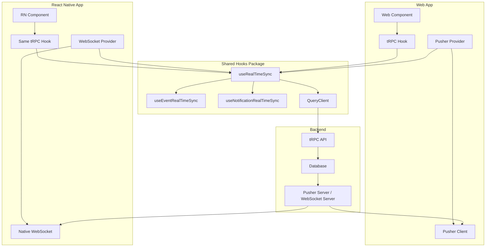

# 🌐 Cross-Platform Real-Time Architecture

## Overview

Our new real-time architecture enables **identical** hooks to work across **Web** and **React Native** with different WebSocket providers underneath. The `@groupi/hooks` package now provides platform-agnostic real-time sync that automatically handles cache invalidation.

## Architecture Diagram



## The Solution: Platform-Agnostic Interface

### 1. WebSocket Provider Interface

```tsx
// packages/hooks/src/use-realtime-sync.ts
export interface WebSocketProvider {
  subscribe(channel: string): void;
  unsubscribe(channel: string): void;
  bind(event: string, callback: () => void): void;
  unbind(event: string, callback: () => void): void;
  disconnect?(): void;
}
```

This interface abstracts away the WebSocket implementation details. **Any** WebSocket technology can implement this interface.

### 2. Platform-Agnostic Real-Time Hook

```tsx
export function useRealTimeSync(
  provider: WebSocketProvider | null,
  config: RealTimeSyncConfig
) {
  const queryClient = useQueryClient();

  useEffect(() => {
    if (!provider) return;

    function invalidateQueries() {
      if (config.queryPredicate) {
        queryClient.invalidateQueries({ predicate: config.queryPredicate });
      }
    }

    provider.subscribe(config.channel);
    provider.bind(config.event, invalidateQueries);

    return () => {
      provider.unbind(config.event, invalidateQueries);
      provider.unsubscribe(config.channel);
    };
  }, [provider, config, queryClient]);
}
```

The hook is **completely agnostic** to the WebSocket provider - it just calls the interface methods.

## Platform-Specific Implementations

### Web: Pusher Provider

```tsx
// packages/hooks/src/providers/web-pusher-provider.ts
export function usePusherProvider(): WebSocketProvider | null {
  const [provider, setProvider] = useState<WebSocketProvider | null>(null);

  useEffect(() => {
    const initializePusher = async () => {
      try {
        const { pusherClient } = await import('@/lib/pusher-client');
        setProvider(new PusherWebSocketProvider(pusherClient));
      } catch (error) {
        console.warn('Pusher not available in this environment');
        setProvider(null);
      }
    };

    initializePusher();
  }, []);

  return provider;
}
```

### React Native: WebSocket Provider

```tsx
// packages/hooks/src/providers/react-native-websocket-provider.ts
export function useReactNativeWebSocketProvider(
  url: string
): WebSocketProvider | null {
  const [provider, setProvider] = useState<WebSocketProvider | null>(null);

  useEffect(() => {
    const wsProvider = new ReactNativeWebSocketProvider(url);
    setProvider(wsProvider);

    return () => wsProvider.disconnect();
  }, [url]);

  return provider;
}
```

## Usage Patterns

### Domain-Specific Hooks (Platform Agnostic)

```tsx
// These hooks work identically on web and mobile!
export function useEventRealTimeSync(
  provider: WebSocketProvider | null,
  eventId: string
) {
  useRealTimeSync(provider, {
    channel: `event__${eventId}`,
    event: 'update_event_data',
    queryPredicate: query => query.queryKey[0] === 'event',
  });
}
```

### Web Component Usage

```tsx
// apps/web/components/event-page.tsx
import {
  useEvent,
  useEventRealTimeSync,
  usePusherProvider,
} from '@groupi/hooks';

function EventPage({ eventId }: { eventId: string }) {
  // Get WebSocket provider for web
  const wsProvider = usePusherProvider();

  // Same hook as React Native!
  const { data: event, isLoading } = useEvent(eventId);

  // Enable real-time sync
  useEventRealTimeSync(wsProvider, eventId);

  // Event data automatically updates via Pusher WebSocket
  return <div>{event?.title}</div>;
}
```

### React Native Component Usage

```tsx
// apps/mobile/components/event-page.tsx
import {
  useEvent,
  useEventRealTimeSync,
  useReactNativeWebSocketProvider,
} from '@groupi/hooks';

function EventPage({ eventId }: { eventId: string }) {
  // Get WebSocket provider for React Native
  const wsProvider = useReactNativeWebSocketProvider(
    'wss://api.yourapp.com/ws'
  );

  // EXACT SAME HOOK as web!
  const { data: event, isLoading } = useEvent(eventId);

  // EXACT SAME real-time sync as web!
  useEventRealTimeSync(wsProvider, eventId);

  // Event data automatically updates via native WebSocket
  return <Text>{event?.title}</Text>;
}
```

## Migration Benefits

### Before: Platform-Specific Everything

```tsx
// Web (Pusher)
const { data } = useEvent(eventId);
useEffect(() => {
  pusher.subscribe(`event__${eventId}`);
  pusher.bind('update', () => queryClient.invalidateQueries(['event']));
}, []);

// React Native (Manual WebSocket)
const { data } = useEvent(eventId);
useEffect(() => {
  const ws = new WebSocket('wss://...');
  ws.onmessage = () => queryClient.invalidateQueries(['event']);
}, []);
```

### After: Platform-Agnostic Hooks

```tsx
// IDENTICAL code for both web and React Native!
const wsProvider = usePlatformWebSocketProvider(); // Different per platform
const { data } = useEvent(eventId);
useEventRealTimeSync(wsProvider, eventId); // Same everywhere!
```

## Advanced Usage

### Multiple Channel Sync

```tsx
// Works on both web and mobile
function useEventPageRealTimeSync(eventId: string, userId: string) {
  const wsProvider = usePlatformWebSocketProvider();

  useMultiChannelRealTimeSync(wsProvider, [
    {
      channel: `event__${eventId}`,
      event: 'update_event_data',
      queryPredicate: query => query.queryKey[0] === 'event',
    },
    {
      channel: `notifications__${userId}`,
      event: 'update_notifications',
      queryPredicate: query => query.queryKey[0] === 'notification',
    },
  ]);
}
```

### Custom WebSocket Providers

You can easily add support for other WebSocket technologies:

```tsx
// Socket.io provider
class SocketIOProvider implements WebSocketProvider {
  constructor(private socket: Socket) {}

  subscribe(channel: string) {
    this.socket.join(channel);
  }

  bind(event: string, callback: () => void) {
    this.socket.on(event, callback);
  }

  // ... etc
}

// SignalR provider
class SignalRProvider implements WebSocketProvider {
  // Implementation for .NET SignalR
}
```

## React Native Setup

### 1. Install Dependencies

```bash
# React Native WebSocket support is built-in
npm install @tanstack/react-query @trpc/client @trpc/react-query
```

### 2. Create Platform Provider Hook

```tsx
// apps/mobile/hooks/use-platform-websocket.ts
import { useReactNativeWebSocketProvider } from '@groupi/hooks';

export function usePlatformWebSocketProvider() {
  return useReactNativeWebSocketProvider(
    process.env.EXPO_PUBLIC_WS_URL || 'wss://api.yourapp.com/ws'
  );
}
```

### 3. Use Identical Hooks

```tsx
// apps/mobile/components/event-page.tsx
import { useEvent, useEventRealTimeSync } from '@groupi/hooks';
import { usePlatformWebSocketProvider } from '../hooks/use-platform-websocket';

function EventPage({ eventId }) {
  const wsProvider = usePlatformWebSocketProvider();
  const { data: event } = useEvent(eventId);

  useEventRealTimeSync(wsProvider, eventId);

  return <Text>{event?.title}</Text>;
}
```

## WebSocket Server Considerations

Your backend WebSocket server needs to support both Pusher protocol (for web) and custom protocol (for React Native):

```javascript
// Backend WebSocket server
server.on('connection', (ws, request) => {
  const clientType = request.headers['user-agent'];

  if (clientType.includes('react-native')) {
    // Handle React Native WebSocket protocol
    ws.on('message', data => {
      const { type, channel } = JSON.parse(data);
      if (type === 'subscribe') {
        subscribeToChannel(ws, channel);
      }
    });
  } else {
    // Handle Pusher protocol for web
    // Pusher handles this automatically
  }
});
```

## Summary

### ✅ Benefits Achieved

1. **🔄 Code Reuse**: Same hooks work on web and mobile
2. **🚀 Faster Development**: Write once, use everywhere
3. **🔒 Type Safety**: Full TypeScript support across platforms
4. **⚡ Real-time Sync**: Automatic cache invalidation everywhere
5. **🔧 Flexibility**: Easy to swap WebSocket providers
6. **📱 Future-Proof**: Ready for React Native without rewrites

### 📊 Code Reduction

| Aspect                   | Before              | After                       |
| ------------------------ | ------------------- | --------------------------- |
| **Real-time Logic**      | Platform-specific   | Shared across platforms     |
| **Hook Implementations** | Duplicated          | Single implementation       |
| **WebSocket Setup**      | Manual per platform | Provider abstraction        |
| **Cache Invalidation**   | Platform-specific   | Automatic via shared hooks  |
| **Testing**              | Test each platform  | Test once, works everywhere |

The new architecture eliminates the need to write separate real-time logic for React Native while providing identical functionality and developer experience across platforms! 🎉
