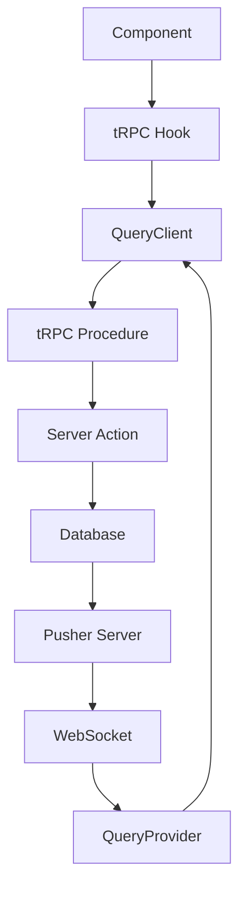
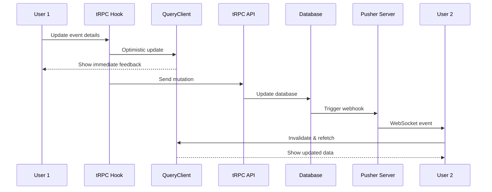

# 🔄 tRPC + QueryProvider + Pusher Integration

## Overview

Our tRPC hooks are designed to work seamlessly with the existing `QueryProvider` and Pusher WebSocket system, giving us the best of both worlds:

- **🔒 Type Safety**: End-to-end types from tRPC
- **⚡ Optimistic Updates**: Instant UI feedback
- **🌐 Real-time Sync**: Pusher keeps all clients in sync
- **🔄 Smart Caching**: React Query handles cache management

## Architecture



## How It Works

### 1. QueryProvider Setup

The `QueryProvider` component sets up both tRPC and Pusher:

```tsx
// apps/web/components/providers/query-provider.tsx
export default function QueryProvider({ queryDefinition, children }) {
  const [trpcClient] = useState(() =>
    api.createClient({
      links: [
        httpBatchLink({
          url: `${process.env.NEXT_PUBLIC_BASE_URL}/api/trpc`,
          transformer: superjson,
          headers: async () => ({
            authorization: token ? `Bearer ${token}` : '',
          }),
        }),
      ],
    })
  );

  // Pusher integration for real-time updates
  useEffect(() => {
    function invalidateQueries() {
      queryClient.invalidateQueries({ queryKey: [queryKey] });
    }

    pusherClient.subscribe(pusherChannel);
    pusherClient.bind(pusherEvent, invalidateQueries);

    return () => {
      pusherClient.unsubscribe(pusherChannel);
      pusherClient.unbind(pusherEvent, invalidateQueries);
    };
  }, [queryKey, pusherChannel, pusherEvent, queryClient]);

  return (
    <api.Provider client={trpcClient} queryClient={queryClient}>
      <QueryClientProvider client={queryClient}>{children}</QueryClientProvider>
    </api.Provider>
  );
}
```

### 2. tRPC Hook Integration

Our tRPC hooks use predicate-based cache invalidation to work with Pusher:

```tsx
// packages/hooks/src/trpc-event-hooks.ts
export function useUpdateEventDetails() {
  const queryClient = useQueryClient();

  return api.event.updateDetails.useMutation({
    onMutate: async ({ eventId, title, description, location }) => {
      // 1. Cancel outgoing refetches
      await queryClient.cancelQueries({
        predicate: query => query.queryKey[0] === 'event',
      });

      // 2. Snapshot current state
      const previousQueries = queryClient.getQueriesData({
        predicate: query => query.queryKey[0] === 'event',
      });

      // 3. Optimistic update
      queryClient.setQueriesData(
        { predicate: query => query.queryKey[0] === 'event' },
        old => {
          const [error, event] = old;
          if (error || !event) return old;

          return [null, { ...event, title, description, location }];
        }
      );

      return { previousQueries };
    },
    onError: (err, variables, context) => {
      // 4. Rollback on error
      context?.previousQueries.forEach(([queryKey, data]) => {
        queryClient.setQueryData(queryKey, data);
      });
    },
    onSuccess: () => {
      // 5. Let Pusher handle real-time sync
      queryClient.invalidateQueries({
        predicate: query => query.queryKey[0] === 'event',
      });
    },
  });
}
```

### 3. Real-time Flow



## Component Usage Pattern

### Before (Server Actions)

```tsx
import { updateEventDetailsAction } from '@/lib/actions/event';

function EventEditor({ eventId }) {
  const [loading, setLoading] = useState(false);

  const handleUpdate = async details => {
    setLoading(true);
    const [error, result] = await updateEventDetailsAction({
      eventId,
      ...details,
    });

    if (error) {
      toast.error('Failed to update event');
    } else {
      toast.success('Event updated');
      // Manual cache invalidation needed
    }
    setLoading(false);
  };
}
```

### After (tRPC + Pusher)

```tsx
import { useUpdateEventDetails, useEvent } from '@groupi/hooks';

function EventEditor({ eventId }) {
  const { data: event, isLoading } = useEvent(eventId); // Auto real-time updates
  const updateEvent = useUpdateEventDetails();

  const handleUpdate = details => {
    updateEvent.mutate(
      { eventId, ...details },
      {
        onSuccess: () => toast.success('Event updated'),
        onError: () => toast.error('Failed to update event'),
      }
    );
    // ✅ Optimistic updates show immediately
    // ✅ Pusher syncs with other clients
    // ✅ Automatic error rollback
  };
}
```

## Benefits

### 1. **Instant Feedback**

- Optimistic updates show changes immediately
- No waiting for server response
- Automatic rollback on errors

### 2. **Real-time Synchronization**

- All clients stay in sync via Pusher
- No manual polling or refresh needed
- Works across browser tabs and devices

### 3. **Smart Cache Management**

- Predicate-based invalidation
- Only relevant queries are updated
- Efficient memory usage

### 4. **Error Handling**

- Automatic rollback on failures
- Consistent error patterns
- Toast notifications for user feedback

## Query Key Strategy

Our hooks use a simple query key strategy that works with Pusher:

```tsx
// tRPC automatically generates query keys like:
// ['event', { input: { eventId: '123' } }]
// ['notification', { input: { userId: 'user-456' } }]
// ['person', { input: { personId: 'person-789' } }]

// We use predicates to match by domain:
predicate: query => query.queryKey[0] === 'event';
predicate: query => query.queryKey[0] === 'notification';
predicate: query => query.queryKey[0] === 'person';
```

This allows Pusher events to invalidate entire domains efficiently.

## Server-Side Integration

### tRPC Procedures Return Safe Wrapper Tuples

```tsx
// packages/api/src/routers/event.ts
updateDetails: protectedProcedure
  .input(UpdateEventDetailsSchema)
  .mutation(async ({ input, ctx }) => {
    // Returns [error, result] tuple from safe wrapper
    return await updateEventDetails({
      eventId: input.eventId,
      title: input.title,
      description: input.description,
      location: input.location,
    }, ctx.userId);
  }),
```

### Pusher Events Triggered from Services

```tsx
// packages/services/src/event.ts
export async function updateEventDetails(input, userId) {
  return safe(async () => {
    const event = await db.event.update({
      where: { id: input.eventId },
      data: { ...input },
    });

    // Trigger Pusher event for real-time sync
    await pusherServer.trigger(`event__${input.eventId}`, 'update_event_data', {
      eventId: input.eventId,
    });

    return event;
  });
}
```

## Migration Benefits

| Aspect                 | Before (Actions)         | After (tRPC + Pusher)          |
| ---------------------- | ------------------------ | ------------------------------ |
| **Type Safety**        | ❌ Manual types          | ✅ End-to-end inference        |
| **Optimistic Updates** | ❌ Manual implementation | ✅ Built-in with rollback      |
| **Real-time Sync**     | ❌ Manual Pusher setup   | ✅ Automatic via QueryProvider |
| **Error Handling**     | ❌ Per-component logic   | ✅ Consistent patterns         |
| **Cache Management**   | ❌ Manual invalidation   | ✅ Smart predicate-based       |
| **Code Reduction**     | ❌ Lots of boilerplate   | ✅ ~40% less code              |

## Best Practices

### 1. Use Optimistic Updates for Better UX

```tsx
// ✅ Good: Optimistic update with rollback
const updateEvent = useUpdateEventDetails();

updateEvent.mutate(
  { eventId, title: 'New Title' },
  {
    onSuccess: () => toast.success('Updated!'),
    onError: () => toast.error('Failed to update'),
  }
);
```

### 2. Let Pusher Handle Real-time Sync

```tsx
// ✅ Good: Trust Pusher for real-time updates
// Don't manually refetch - Pusher will invalidate when needed

// ❌ Bad: Manual polling or refetching
setInterval(() => refetch(), 5000);
```

### 3. Use Predicate-based Cache Invalidation

```tsx
// ✅ Good: Invalidate by domain
queryClient.invalidateQueries({
  predicate: query => query.queryKey[0] === 'event',
});

// ❌ Bad: Hardcoded query keys
queryClient.invalidateQueries({ queryKey: ['event', eventId] });
```

## Conclusion

The tRPC + QueryProvider + Pusher integration gives us a modern, type-safe, real-time application architecture with minimal boilerplate and maximum developer experience. Our hooks work seamlessly with the existing WebSocket infrastructure while providing powerful optimistic updates and automatic error handling.
